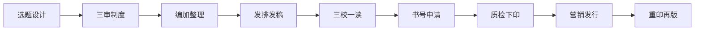


**特别感谢**
感谢超级专业的、真正の编辑——**凉心**！凉心姐姐为本文提供了非常专业的审核，欢迎大家关注她的小红书账号：95326701035


# 出版与编辑

**出版**，全称为 “**出版活动**”，是对作品进行选择、编辑、复制并向公众传播的专业活动。它涵盖了从原始稿件到最终出版物的一系列复杂过程，目的是将有价值的信息传递给读者。

**编辑**则具有双重身份，既可以是一个动词，表示**对资料或已有作品进行整理、加工的过程**，也可以是一个名词，指代从事组织、采录、收集、整理、纂修、审定各种精神产品及其他文献资料并使其传播展示于社会公众的工作者，例如**出版社编辑**。编辑是出版工作的重要组成部分，是出版物复制和发行的前提，其主要目的在于生产出版物的精神文化内容，是对作品进行策划、组织、审读、选择和加工的专业精神生产活动。


**编辑的工作职责**

编辑的工作职责主要包括以下三点：
1. **保证图书质量（确定下限）**
这是编辑工作的基础要求。编辑需要对稿件进行严格的审读，检查内容是否存在错误、遗漏或不合理之处，确保图书在政治性、思想性、科学性和知识性等方面符合标准，避免出现低级错误，为读者提供准确可靠的信息。
2. **促进图书品质提升（拉高上限）**
除了保证基本质量外，编辑还应发挥专业素养，对作品进行深入挖掘和精心加工。通过优化结构、润色文字、提升逻辑性等方式，使图书在内容上更具吸引力和可读性，帮助作者更好地表达思想，提升图书的整体品质和价值，使其在市场上更具竞争力。
3. **保证出版时效**
在保证质量和品质的前提下，编辑需要合理安排工作进度，确保图书能够按时出版发行。这要求编辑具备良好的时间管理能力和协调能力，与作者、排版人员、印刷厂等各方密切配合，避免因自身工作延误导致出版周期延长，以满足读者的期待和市场需求。


# 出版流程


pie


一本图书的出版，一般经历了以下几个阶段：

1. **选题设计**
这是图书出版的起始环节，主要包括信息采集、选题策划、立项申报和组稿等工作。编辑需要通过多种渠道收集信息，了解市场需求、行业动态和读者喜好，结合出版社的定位和发展方向，策划出具有市场潜力和文化价值的选题。同时，编辑还需与作者进行沟通，明确写作要求和出版计划，为后续的编辑工作奠定基础。

2. **三审**
初审由责任编辑负责，主要对稿件进行全面的审读，判断其是否符合选题要求，检查内容的质量、结构的合理性以及语言表达等基本情况。复审一般由编辑室副主任担任，在初审的基础上，对稿件进行更深入的审核，重点关注政治性、思想性和学术性等方面的问题，确保稿件具有较高的出版价值。终审则由总编、社长等高层领导负责，对稿件进行全面评估，作出是否出版的最终决定。

3. **整理加工**
在三审通过后，编辑需要对稿件进行加工整理，包括制定编辑计划、执行编辑方案等。这一步骤要求编辑对稿件进行细致的校对和修改，规范文字表达、调整结构、补充缺失内容等，使稿件达到出版的水准。

4. **发排、发稿**
完成编辑加工整理后，进入发排、发稿阶段。编辑需要与排版人员沟通，确定版式设计，如字体、字号、行距等，确保排版符合图书的整体风格和阅读习惯。同时，编辑要将整理好的稿件发送给排版人员进行排版，并对排版后的样稿进行审核，及时修改排版过程中出现的问题。

5. **三校一读**
这是图书出版过程中的校对环节，主要包括一校、二校、三校和通读。一校主要检查排版是否正确，文字、标点符号是否准确无误；二校则更注重内容的连贯性、逻辑性和结构的合理性；三校进一步细化检查，确保所有问题都得到解决。通读是在三校的基础上，对整个书稿进行最后的通读检查，确保图书内容质量符合出版要求。

6. **书号申请**
书号是图书的唯一标识符，编辑需要向新闻出版总署申请书号，并准备相关的版权材料，如作者信息、内容提要等。这一步骤对于图书的合法出版和市场销售至关重要。

7. **质检 / 下印**
在图书印刷前，需要对排版后的书稿进行质量检查，包括封面、内文等的检查。确保图书在印刷过程中不出现问题，保证印刷质量符合标准后，才能正式下达印刷指令。

8. **销售 + 营销**
图书出版后，编辑需要配合营销人员制定销售和营销策略，通过各种渠道推广图书，提高图书的知名度和销量。这可能包括参加书展、举办宣传活动、利用社交媒体进行宣传等方式。

9. **重印 / 再版**
根据图书的销量和市场需求，编辑需要评估是否进行重印或再版。如果图书受到读者的欢迎，市场需求持续旺盛，编辑则需要与作者协商，进行重印或再版工作，以满足读者的需求。

# 那么一本书由什么部分组成呢

一本出版了的书由外部和内部几部分组成。外部包括封一（封面）、封四（封底）、书背（书脊）、封二（前封里）、封三（后封里）、护封、腰封和勒口。内部包括扉页（内封）、版权页（版本记录页）、序和前言、目录以及正文。

- **外部部分**
    - **封一**（封面）是图书的外表面，通常印有书名、作者名和出版社等信息，起着吸引读者和保护图书的作用；
    - **封四**（封底）一般印有图书的简介、作者简介、出版信息以及条形码等；
    - **书背**（书脊）则印有书名、作者名和出版社名，方便读者在书架上查找图书；
    - **封二**（前封里）和**封三**（后封里）一般是白色的，有时也会印有一些与图书相关的信息；
    - **护封**包在封面、封底外面，起到保护封面的作用；
    - **腰封**是包裹图书腰部的一条纸带，通常印有宣传语或重点内容介绍，以吸引更多读者；
    - **勒口**是封面和封底在骑扣一侧向内折叠的部分，可用于印刷作者照片、简介等信息。

- **内部部分**
    - **扉页**（书名页/内封）位于封面之后，一般印有书名、作者信息、出版社和出版年月，是图书的正式开始；
    - **版权页**（版本记录页）印在扉页之后，帮助读者了解图书的出版情况，包括书号、版次、印次等信息；
    - **序和前言**置于文前，是评价本书或作者的文字，通常由专家学者或作者本人撰写，为读者提供阅读指导和背景信息；
    - **目录**是全书内容的纲要，列出各章节的标题和页码，方便读者快速浏览和查找内容；
    - **正文**则是图书的核心部分，承载着作者的主要内容和思想观点。

此外，还涉及 **CIP 数据**、**版次**与**印次**、**条码**等概念。CIP（Cataloguing In Publication）是图书在版编目数据，用于在新闻出版总署备案。版次表示图书版别，印次表示同一种图书重复印刷的次数。条码是由黑条和白空组成的条形图案，用于图书的管理和销售。目前我国出版物条码分两类：**中国标准书号条码**（又包括图书条码、电子出版物条码和音像制品条码）和**中国标准刊号条码**。

>- **版次**是用白表示图书版别的，首次出版时叫“**第一版**”或“**初版**”，内容有重大修改、重新排印出版的叫“**第二版**”，之后再经过修改排印出版就叫“**第三版**”，以此类推。只改变封面、个别勘误替换不会改变版次，只改变印次。
>- **印次**是同一种图书重复印刷的次数。从第一版第 1 次印刷起每重印一次，即须在在版本记录页上累计表明。如第一版印了 3 次，改版后重印时应记录为**第二版第 4 次印刷**。

# 版式与排版

图书的版式设计是一个复杂而精细的过程，涉及多个方面，包括全张纸与开本、印张与页数、版式、版面与版心、书眉和页码、页、面、天头、地脚、篇章页、订口和切口等。

我们先来看看什么是**全张纸**与**开本**。全张纸是指造纸企业按照一定长度和宽度生产的印刷用平板纸品，尺寸一般有 787mm × 1092mm、880mm × 1230mm、850mm × 1168mm 等。开本则是出版业中专门用以表示书刊幅面大小的专业用语，指用全张印刷纸开切的若干份。我们经常听说某某书是 16 开、8 开等，常见的开本有 8 开、16 开、32 开、64 开等，另外还分竖开本和横开本，大小差别如上图所示。不同的开本适用于不同类型的图书，16 开本常用于学术著作和杂志，32 开本则多用于小说和通俗读物。

> 如果对大小还是没有直观的概念，可以回忆一下小学买书皮的时光。适合练习册的大书皮就是16开的，而适合课本和笔记本的小书皮就是32开的。

在了解过开本的概念之后，我们可以看看**印张**与**页数**的概念了。印张是**计算出版物篇幅**的单位，全张纸印刷一次（纸的一面）就叫做一个印张，两面都印刷之后就叫做两个印张。印张与开本、页码密切相关，对于一本 32 开的书，一印张就等于该书的 32 个页码。同理，对于一本 64 开的书，一印张等于该书的 64 个页码。

$$印张数 = \frac{正文页面数 + 辅文页面数 + 空白页面数}{开本数}$$

在出版术语中，一**页**包括两**面**，每一页有两个相邻的页码，其中单码在正面、双码在反面。我们现在终于可以看看页面内部由什么组成了，但首先要区分三个概念：**版式**、**版面**与**版心**。

- 版式指的是**书刊内容的全部排版格式**，包括正文、标题、图表、书眉、注文、页码等的排式、字体、字号，以及版心大小（每面几行、每行几字、行间空距离），用什么标点符号、有无题图、尾花、补白等。
- 版面是出版物**每一面上内容的整体安排**，包括文字、图表及四周的空白在内。
- 版心是出版物**印有文字、图表的部分**，不包括四周空白。合理的版式、版面和版心设计能够提升图书的美观度和可读性，使读者在阅读过程中更加舒适。

从上图可以看到，在一面中除了版心之外，还包括了**书眉**、**页码**、**天(头)**和**地(脚)**。

- 书眉是版心上方端加印的一行文字，主要为了便于读者翻阅检索。书眉一般印有篇、章、节标题和页码。通常情况下，单页码（右侧页面）书眉层级小于双页码（左侧页面）书眉，例如双页码书眉是书名，单页码书眉是章节名。
- 页码可以单独设置在**版心下端**（地脚的位置），也可以位于**版心上方**（书眉的位置），但必须单页码居左、双页码居右。
- 天头和地脚分别指的是书刊版心上下两部分空白，一般来说天头大于地脚，留有这两个部分是为了让版面更美观、便于封装，也为使读者学有所得时做些记录留有余地。

除了正文之外，图书可能还会有**辑封（篇章页）**存在。辑封是在正文的各个主要部分（例如每篇、每章）之间排一面单页，上面印有篇、编或章的名称，通常背面是空白的。辑封的设置有助于读者快速定位和浏览图书内容，增强图书的条理性，需要单独设计。

# 印刷与装订

设计好图书的版式和排版，就可以进入印刷与装订的环节了。

在版心的左右两侧，我们可以找到**订口**和**切口**。订口是书刊装订（胶封等）的那一面，而切口是订口之外的其他需要切光的三面，分为**上切口、下切口和外切口**。页码一般都放在切口一侧，以便读者翻检。

要印刷一本书，首先要选择印刷用纸。每种纸张都有其种类，一般按照 1 平方米的纸的克重对纸品进行区分。常见的印刷用纸有：

1. **铜版纸**
    - 250g 一般用于胶订印张大于 10 的重点书
    - 200g 一般用于印张在 7 - 10 的胶订书
    - 157g 褊头 / 骑订（覆膜）印张在 7 以内的书
    - 128g 褊头 / 骑订。
2. 胶版纸（内文）：有 58g、60g、70g、80g。
3. 牛皮纸（封面）：一般用在试卷封面。

在选择完纸品之后，我们还需要考虑书本的装订形式。装帧形式包括**骑马订**（通常用于 100 页以内的小册子，采用订书钉装订）、胶订（胶水刷的，时间长了有可能开裂）、裸背锁线（背后看上去一条一条，是用线把一小撮一小撮纸穿起来，这样虽然书很厚但可以铺平）、精装（采用复杂工艺，这样书比较好看）。

我们还要考虑如何印刷图书。印刷颜色有CMYK四色印刷（青、品红、黄、黑），图书颜色分为单黑（只有黑色）、双色/专色（采用两种颜色，需要走两遍印刷机）、四色（需要走四遍印刷机，成本高昂）。

这时候我们的图书其实已经可以出版了，不过我们还可以加一些锦上添花的步骤，例如：

- **覆膜**：覆膜指的是在印刷品表面覆盖一层塑料薄膜，可以起到保护书籍的作用。厂家会采用粘合剂经过加热、加压后使覆膜和印刷品表面粘合在一起，形成纸、塑合一的印刷品加工技术。覆膜通常分为**光膜**和**哑膜**两种（近年来也有触感膜等新工艺出现），光膜使产品表面亮丽、表现力强；哑膜则使表面不反光、更能显示高雅气质。
> 128g 以下的纸张不适合覆膜，通常用于 200g 以上的纸张。

- **塑封**：图书塑封是通过包装设备把塑料膜套在外面，然后通过高温的收缩机械设备，收缩后就可以达到完美的塑封效果，可以起到保护图书的作用。

- **光油和 UV** ：光油是指涂覆在印刷品表面，起到增加光泽度、耐磨性、防水性的一种液体。国内使用的一般是水性上光油，具有非常好的环保性能。UV 则是靠紫外线照射固化的一类油墨，可以在印刷品表面呈现出多种艺术特效。通常是覆膜后再上局部 UV。

除此之外，还有各种丰富多彩的印刷工艺，例如烫金、凹版印刷、凸版印刷等，在本文中就不过多赘述了。