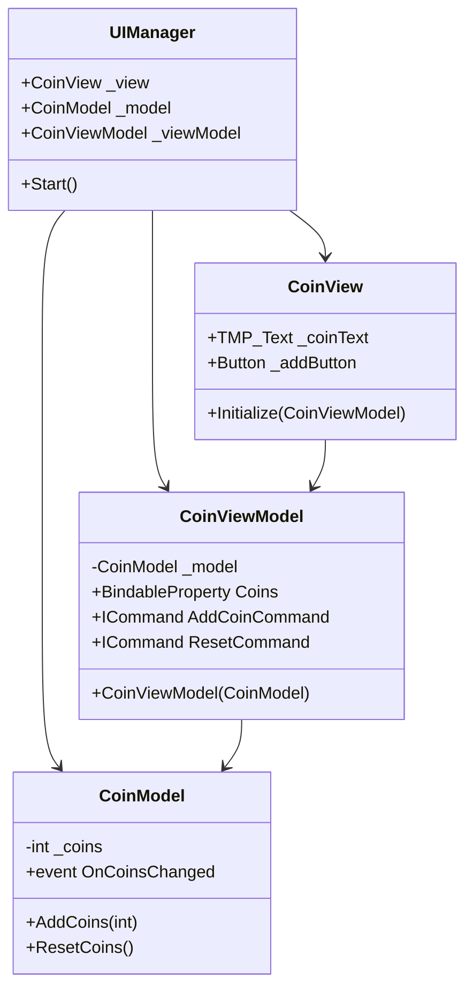
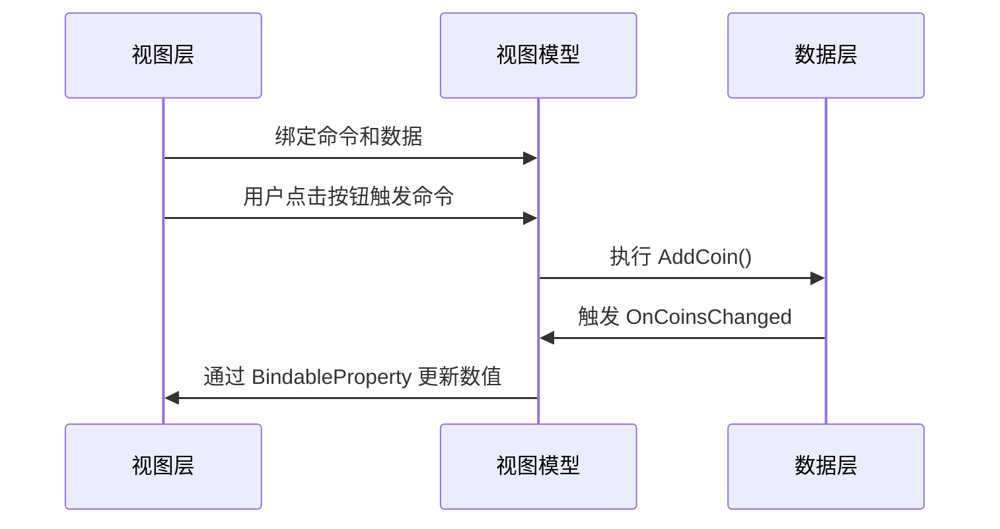

我们在<a href="https://cattyhouse-guiny.xyz/2021/05/19/%E8%AE%BE%E8%AE%A1%E6%A8%A1%E5%BC%8F/mvc%E8%AE%BE%E8%AE%A1%E6%A8%A1%E5%BC%8F/">上一篇文章</a>中提到了 **MVC**（Model-View-Controller）设计模式。在 Unity 中，MVC 模式通常体现在将游戏数据（M）和表现（V）分开，而 C 则负责管理输入和调度更新，在代码中更新 UI 的状态。

在这篇文章中，我将介绍另一种设计模式 **MVVM**（**Model** - **View** - **ViewModel**）。MVVM 是一种将用户界面与业务逻辑分离的设计模式，与 MVC 模式相比，MVVM 模式在 MVC 的基础上进一步解耦了 View 和 Model，取代 Controller 的 ViewModel 层（VM 层）作为中介层提供了**数据绑定**的能力，使 View 层可以**自动同步** ViewModel 中的数据。

| 维度       | MVC                          | MVVM                          |
|------------|------------------------------|-------------------------------|
| **核心思想** | 关注点分离                   | 数据驱动视图                   |
| **数据流向** | 单向（View → Controller → Model） | 双向（View ↔ ViewModel ↔ Model） |
| **耦合度**  | 中（V 层与 C 层直接交互）           | 低（通过数据绑定解耦）          |
| **适用场景** | 简单UI交互                   | 复杂数据驱动型UI                |
| **Unity实现** | 需要手动更新视图             | 自动响应数据变化                |

在 Unity 中，采用 MVVM 架构可以让 UI 开发更加响应式，当 Model 发生变化时，通过 ViewModel 自动更新 UI。我们还是以上篇文章中的金币案例为例，分析一下 MVVM 框架的代码结构。


pie




# Model（M）
MVVM 中的 M 层与 MVC 中的 M 层相同，都负责了**数据存储**和相关**业务逻辑**：

```C#
[System.Serializable]
public class CoinModel 
{
    private int _coins; // 数据
    public event Action<int> OnCoinsChanged;    // 数据改变事件

    // 业务逻辑
    public void AddCoins(int amount)
    {
        _coins += amount;
        OnCoinsChanged?.Invoke(_coins);
    }
    public void ResetCoins() {
        _coins = 0;
        OnCoinsChanged?.Invoke(_coins);
    }
}
```

# View（V）
V 层负责了用户图像界面的展示，通过**绑定器**与 ViewModel 层连接：

```C#
public class CoinView : MonoBehaviour
{
    // 这部分和 MVC 一样，都需要获取非静态 UI
    [SerializeField] private TextMeshProUGUI _coinText;
    [SerializeField] private Button _addButton;
    [SerializeField] private Button _resetButton;

    // 通过绑定器连接ViewModel
    public void Initialize(CoinViewModel vm)
    {
        // 数据绑定
        vm.Coins.Bind(value => _coinText.text = value.ToString());
        
        // 命令绑定
        _addButton.onClick.AddListener(() => vm.AddCoinCommand.Execute());
        _resetButton.onClick.AddListener(() => vm.ResetCoinsCommand.Execute());
    }
}
```

在 MVC 中，我们是通过 `Initialize` 方法直接实现 UI 对象和事件的绑定的，而在 MVVM 中则是使用了绑定器的思想，在 `Initialize` 中绑定**数据**和**命令**。

# ViewModel（VM）
VM 层是联系 M 层和 V 层的核心桥梁，实现了数据转换与命令处理：

```C#
public class CoinViewModel
{
    private CoinModel _model;   // 持有model
    
    // 可绑定属性（暴露给View绑定）
    public BindableProperty<int> Coins { get; } = new();
    
    // 可绑定命令（暴露给View绑定）
    public ICommand AddCoinCommand { get; }
    public ICommand ResetCoinsCommand { get; }


    public void CoinViewModel(PlayerModel model)
    {
        _model = model;
        // 数据
        _model.OnCoinsChanged += coins => Coins.Value = coins;
        // 命令
        AddCoinCommand = new RelayCommand(() => _model.AddCoins(1));
        ResetCoinsCommand = new RelayCommand(() => _model.ResetCoins());
    }
}
```

在 VM 的示例代码中，我们看到了 `ICommand` 和 `BindableProperty<T>`，分别实现了命令和数据的绑定。

## 数据绑定器 BindableProperty\<T\>
数据绑定器 **BindableProperty\<T\>** 实现了在所绑定的属性变更时发出通知。

```C#
public class BindableProperty<T>
{
    private T _value;   // 绑定的值
    public T Value
    {
        get => _value;
        set
        {
            _value = value;
            OnValueChanged?.Invoke(value);  // 值发生改变时，事件触发
        }
    }
    public event Action<T> OnValueChanged;

    // 绑定逻辑
    public void Bind(Action<T> callback)
    {
        OnValueChanged += callback;
        callback(Value); // 初始化回调
    }
}
```

## 命令绑定器 ICommand
熟悉**命令模式**的同学看到 **ICommand** 这个名字的时候，大概就能想到这是一系列命令的接口，包含了命令的执行逻辑 `Execute`（如果需要，也可以为命令模式加上重做逻辑 `Redo`）。

RelayCommand封装了操作请求的独立对象，是一个具体**命令的包装器**，可以将任意方法包装成符合 ICommand 接口的对象。

```C#
// 命令接口
public interface ICommand
{
    void Execute();
}
// 具体命令包装器
public class RelayCommand : ICommand
{
    private readonly Action _execute;
    
    public RelayCommand(Action execute) => _execute = execute;
    public void Execute() => _execute?.Invoke();
}
```

# 实际应用
由于同一个 ViewModel 可以绑定不同 View，因此我们可以建立一个管理器来管理 MVVM：

```C#
// 使用示例
public class UIManager : MonoBehaviour
{
    [SerializeField] private CoinView _view;
    [SerializeField] private CoinModel _model;
    private CoinViewModel _viewModel;

    void Start()
    {
        _viewModel = new CoinViewModel(_model);
        _view.Initialize(_viewModel); // 显式初始化
    }
}
```

MVVM 的交互流程如下所示：


pie




在 Unity 中，MVVM 的优势体现在以下三个方面：

1. **自动同步**：当 Model 数据变化时，View 自动更新。
2. **解耦视图逻辑**：ViewModel 不直接操作UI组件。
3. **复用性**：同一 ViewModel 可绑定不同 View。

# 参考资料
https://docs.unity3d.com/Packages/com.unity.dt.app-ui@0.3/manual/mvvm-intro.html
https://medium.com/etermax-technology/embracing-changes-with-mvvm-14fcf6d35468