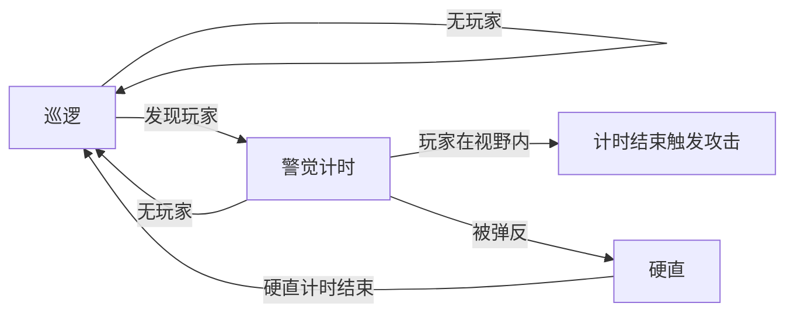
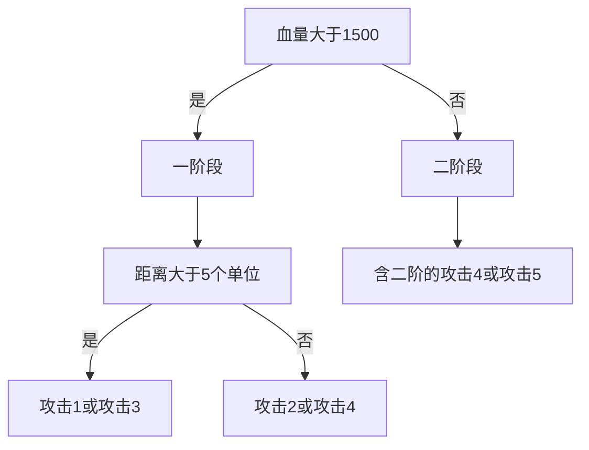

十一月毕业典礼结束之后我终于算正式毕业了，随着腾讯 2024 游戏创作大赛颁奖典礼的结束，《终面/OneLastInterview》的开发到现在也算是告一段落了。《终面》能在众多参赛作品中突围进入决赛，这已经是大赛方对我们的努力和实力的认可了，很开心。

最近正值秋招时节，经常被问到简历上的项目，《终面》作为我最新的项目自然是被经常提及的，经过面试官们的点拨，我也认为项目中的关卡系统和战斗系统需要结合业内做法更进一步的改进。本文将重点讨论战斗系统方面的优化，探讨如何实现更好的战斗系统。

首先介绍一下《终面》中 Boss 战斗相关逻辑的策划案。对于Boss从巡逻到发起攻击，其中的逻辑是：


pie


> 注：硬直时玩家的伤害倍率提升为2倍。

对于boss所使用的具体攻击招式，则分为了两个阶段：

- **一阶段**（血量大于1500）
  - 攻击1（远程）
    玩家距离boss较远时，boss向玩家方向进行连续远程攻击，连续 3 次，每次间隔 1 秒，每次瞄准当前玩家位置发射，飞行道具可弹反。
  - 攻击2（近战）
    主动靠近玩家，向玩家挥出 3 连击，每击都有感叹号提示，任意一击被弹反即打断此次攻击，使boss硬直 2 秒
  - 攻击3（远程）
    朝向玩家所在位置的水平方向（正左/正右）进行蓄力，完成后有感叹号，随后朝玩家冲刺，弹反成功boss眩晕硬直 2 秒。
  - 攻击4（近战）
    玩家在boss身边时，短暂蓄力后对身边360度一圈挥舞武器，半径为 2 个玩家身位，蓄力完成后有感叹号，且有短暂红圈提示范围。

- **二阶段**（血量小于1500）
  - 攻击4派生1：此次攻击如被弹反，则会接着向玩家位置方向施放**攻击3**。
  - 攻击4派生2：此次攻击如未被弹反，则会蓄力释放一次半径为 4 个玩家身位的 360 度攻击，蓄力完成后有感叹号，且有短暂红圈提示范围，成功弹反此次攻击，boss眩晕硬直 5 秒。
  - 攻击5：boss瞬移到场地中央，向天上抛洒炸弹，动作结束后场地上随机出现 6 处（boss左边右边各 3 个）半径为一个玩家身位的攻击预警红圈 + 一个固定出现在玩家当前位置的红圈，2 秒后红圈消失、炸弹落地。不可弹反。

由此我们可以看出，boss的出招是综合了血量和玩家距离两个因素考虑的，抽象成流程图如下所示。为了提升游戏的体验，策划同学在一种情况下设置了多种攻击方式，具体使用哪种是完全随机的。

# 基于状态机的做法
我是怎么实现战斗系统的呢？其实战斗系统需要考虑的核心主要有三点：

1. boss是否能释放此技能
根据配置获取技能能释放的条件，比如血量是否大于1500、距离是否大于5个单位等。

2. 播放技能的动画和音频等特效
加载动画和特效的资源素材，并播放动画，做好动画状态机切换等

3. 计算技能对目标照成的伤害
每个技能放出后，设置一个时间点来计算攻击与伤害，比如有一个技能动画3秒，当播放到2秒的时候计算伤害

由于我们的开发时间有限，在毕设开发阶段我们直接使用了 Unity Asset Store 上的 Corgi Engine 进行开发。Corgi Engine 内部集成了常用怪物 AI 的相关功能（例如射击、切换武器、检查玩家是否在视野内、跟随玩家、计时器等等），同时提供了一个名为 AI Brain 的脚本，方便用户设置敌人 AI 的逻辑。

AI Brain 实际上是一个**状态机**，下面是boss战中出现的所有状态。在做本科毕设的时候我发布过一篇介绍<a href="https://cattyhouse-guiny.xyz/2023/05/10/%E6%B8%B8%E6%88%8Fai-%E7%8A%B6%E6%80%81%E6%9C%BA%E4%B8%8E%E8%A1%8C%E4%B8%BA%E6%A0%91/">状态机与行为树</a>的文章，其中提到状态机很容易出现<u>状态爆炸</u>的问题，下图就足以体现了：

每个状态包含了所执行的逻辑和状态转移的条件。以巡逻（不要在意我为什么写成了Idle）和预攻击判断（Pre-Attack）为例，巡逻过程中boss会不断检测玩家是否位于视野内，如果发现玩家就进入预攻击判断的状态。在预攻击判断状态中，根据boss当前血量决定选择阶段1还是阶段2，其他状态类似。

以攻击3为例，在具体的战斗状态中，相关逻辑是直接通过一个装载了实现了AIAction接口的功能性脚本（例如下图中的移速增加、攻击3逻辑）数组的方式去执行的（脚本会执行每个实现该接口类的PerformAction()方法）。

> 我的攻击 3 逻辑包括了朝玩家冲刺的逻辑、设置动画机参数和音频触发等等。实际上这样耦合度有点高，可以为设置动画机参数和音频专门写一个 AIAction，这样方便复用逻辑。

由于每个攻击存在动画时长，必须为状态设置一个匹配时长的退出时间（例如下图中的冲刺时长），以免出现攻击一触发就秒退状态或者状态和动画时长不匹配的问题。

采用状态机实现战斗系统的缺点十分明显，那就是如果要做到精确的帧控制需要颇费一番功夫。同时存在状态爆炸等问题，代码维护起来较为痛苦。我们也可以用行为树去优化状态机下的战斗系统，虽然可以简化代码但仍无法避免对效果的精确控制上的问题。通过状态机/行为树实现的战斗系统比较适用于一些状态同步的项目，例如 Moba 类游戏。

# 基于Timeline的优化

Timeline 是 unity 自带的时间线插件，可以很好的实现 cg、动效等内容。同时扩展简单，是游戏开发不可或缺的一个重要组件。我个人使用 Timeline 的场景不多，在本科期间某节课的结课项目中有用它制作过影片，当时只感觉它很适合用来做过场动画，没有深入挖掘过 Timeline 的强大功能。

上图展示了一个用 Timeline 制作的攻击序列，其中包含了：

- **Track Group**
	- 轨道组，可以放多个 track，用来按组分类划分
	- 没有实际功能，只是用来帮助开发者进行分类的（就像文件夹）
	
- **Activation Track**
	- 激活轨道，用来控制物体是否激活（显示或隐藏）的轨道，颜色为**绿色**
	- Active 时对象可见，非 Active（无内容）时对象不可见
	- 例：上图中 Squad Car 轨道组里的三个轨道
	
- **Animation Track**
	- 动画轨道，用来控制 Animation 的播放，颜色为**蓝色**
	- 可以直接在动画轨道中 k 帧（例如上图中的 Main Camera）
	- 也可以直接使用 Clip 组合动画效果（例如上图中的Attacker1）
	
- **Audio Track**
	- 音频轨道，用来控制Audio的播放，颜色为**橙色**
	- 可以将音频 Clip 添加到该轨道
	
- **Control Track**
	- 控制轨道，用来控制预制件、特效、游戏对象等，颜色为**青色**
	- 在 Clip 外会被自动销毁（如上图中的Explosion）
	
- **Signal Track**
	- 信号轨道，用来发射信号（触发事件）
	- 可以精确控制信号在哪一帧发出（类似动画事件）
	- 实际上开发者可以在任意一种轨道的任意一阵插入信号。独立的Signal轨道只是起到了方便管理的作用。
  
  
- **Playable Track**
	- 用户自定义轨道，通过脚本控制，颜色为**白色**
	- 例如上图中的 LookAt ，用于实现逻辑

借助Timeline，我们可以将攻击动画、音效等攻击效果通过可视化界面实现精确的帧控制，它也天然适合帧同步类型的游戏。前文中，我们提到战斗系统的三要素是：

1. **判断**：boss是否能释放此技能

2. **效果**：播放技能的动画和音频等特效

3. **伤害**：计算技能对目标照成的伤害

很显然，Timeline 自身的特性非常适合做**效果**，通过 **Signal** 也可以实现在某一帧触发**伤害**计算，一些其他的特殊战斗逻辑（例如面朝玩家、锁定玩家、向玩家移动等）则可以通过 **Playable Track** 实现。

结合前面的状态机思想，可以将每个状态中 boss 的行为替换成播放对应的 Timeline 资产。当然我们也可以考虑采用行为树或行为树+状态机（当一个AI足够复杂时，可以在行为树中嵌套状态机，避免行为树的遍历开销）的方式实现战斗系统。

当然，我的想法还有很多幼稚的地方，欢迎各位在评论区交流看法！
# 参考资料
https://www.zhihu.com/question/441024228/answer/1696249544
https://www.zhihu.com/question/459078412/answer/1953550596
https://zhuanlan.zhihu.com/p/513872343
https://unity.com/blog/engine-platform/how-to-use-timeline-signals
